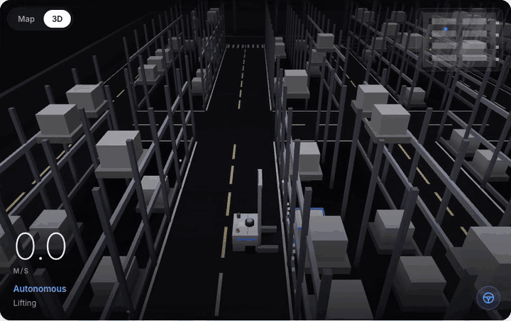
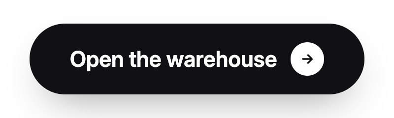
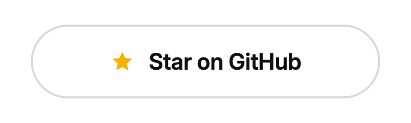
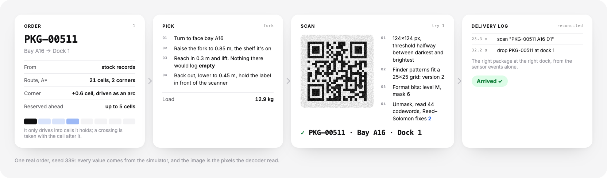
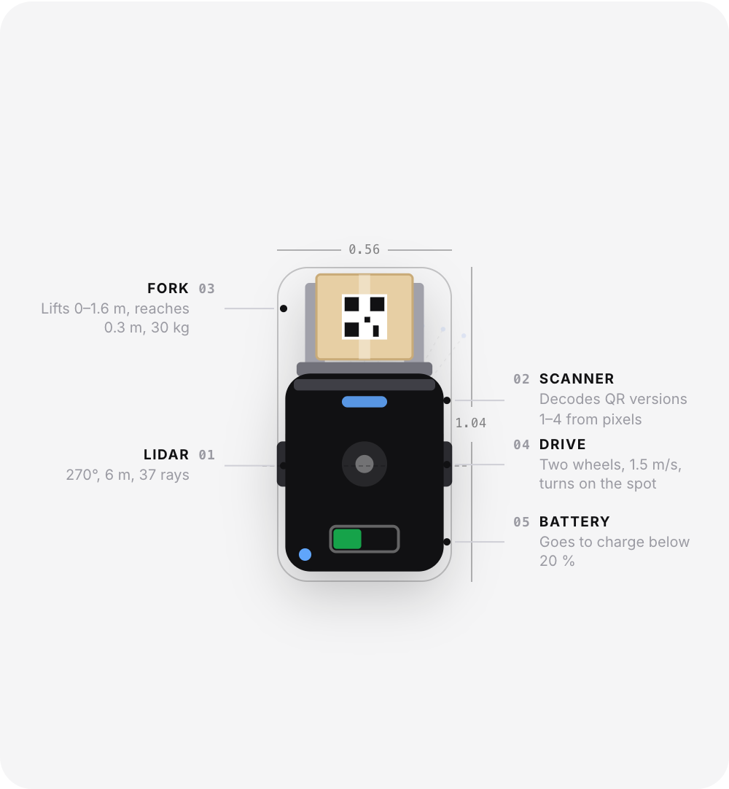
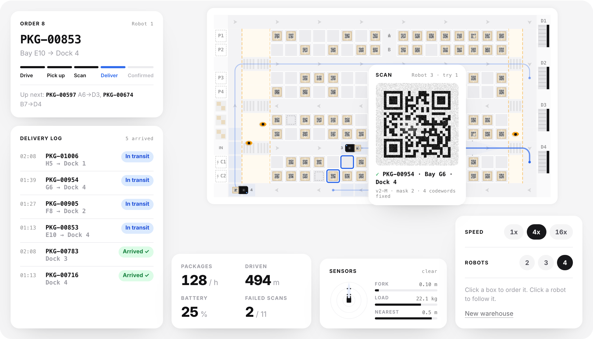

# forklift

A forklift robot works a small warehouse in the browser: it plans a route down one-way aisles, lifts a package out of its bay, decodes the QR label from pixels and drops it at the right dock, while a delivery log checks every step. Plain JavaScript.

<p align="center">
  <a href="https://stxqq.github.io/forklift/"></a>
</p>

<p align="center">
  <a href="https://github.com/Stxqq/forklift/actions/workflows/ci.yml"></a>
  <a href="https://stxqq.github.io/forklift/"></a>
  <a href="LICENSE"></a>
  
  
</p>

<p align="center">
  <a href="https://stxqq.github.io/forklift/"><picture><source media="(prefers-color-scheme: dark)" srcset=".github/assets/launch-dark.png"></picture></a>&nbsp;&nbsp;<a href="https://github.com/Stxqq/forklift"><picture><source media="(prefers-color-scheme: dark)" srcset=".github/assets/star-dark.png"></picture></a>
  <br>
  <sub>If you found it useful, a star helps more people find it.</sub>
</p>

The page is a warehouse seen from above: eight rows of rack bays, aisles
that only run one way, four docks on the east wall, two chargers and three
people walking about. Every box carries a QR label that says what it is,
where it belongs and which dock it goes to, like `PKG-00511 A16 D1`.

The scanner doesn't peek at the simulation to find out what's on the fork.
It gets a grayscale image of the label, with sensor noise, the odd
reflection from the roof lights and whatever smudges or tears the label
has, and decodes it the way a phone would: find the code, read the format,
unmask, de-interleave, correct with Reed–Solomon, parse. If that fails
twice, the bay gets flagged for a person. The encoder and the decoder are
written from the standard, about 600 lines with no library.

About one box in ten is in the wrong bay or not there at all, and one in
five has a smudged or torn label. The delivery log never takes the robot's
word for anything: each line is worked out from what the fork found, what
the scanner decoded and what was set down at which dock, against what the
order asked for.

- **Watch**: one robot works through orders from the stock records.
- **Dispatch**: click a box to order it. Two to four robots share the
  aisles, reserve cells ahead of them and yield at crossings.
- **Drive**: ↑ ↓ to drive, ← → to turn, Space to work the fork, S to scan.

## How it works

<p align="center">
  
</p>

Everything moves in fixed steps of 1/60 s. The diagram is one real order
from seed 339, and the picture in it is the exact image the decoder read.

- **Warehouse.** 26 by 15 one-meter cells. Robots drive a clockwise ring,
  three cross aisles and a southbound shortcut down the middle, all one
  way, so two robots never meet head on. People walk on two strips beside
  the racks and cross the aisles on marked crosswalks. The layout is
  fixed; the stock, the labels and their damage come from the seed.
- **Orders.** An order names a package, the bay the records say it's in,
  and the dock on its label. Watch keeps three waiting; in Dispatch they
  come from your clicks.
- **Planner.** A* over cells and headings. A corner costs 0.6 of a cell on
  top, so of two equally long routes the straighter wins. A test checks it
  against Dijkstra on the same graph.
- **Reservations.** A robot only drives into cells it holds, and asks for
  up to three ahead. A crossing is only granted together with the cell
  after it, so nobody stops inside one and blocks the other lane. A cell
  is handed back once the robot's center is a full cell past it, so two
  robots are never closer than one meter, corners included. The lanes are
  one way and the shortest loop in them is 28 cells, so four robots can't
  end up waiting on each other in a circle.
- **Robot.** Differential drive, 0.72 m long, 1.5 m/s. It speeds up with
  limited jerk, brakes in time for the end of what it holds, takes corners
  as quarter circles at 0.8 m/s, and turns on the spot only to start a
  route or to face a bay or a dock. The fork lifts 0 to 1.6 m and reaches
  0.3 m, both eased.
- **Safety field.** The robot watches the next 3.2 m of its route, bends
  included. A person less than 0.95 m from that line slows it down; one
  less than 0.62 m from it and within 1.35 m stops it. A person waits at a
  crosswalk while a robot is within 1.7 m or holds the cell.
- **Scanner.** The label is rasterized at four pixels per module with
  noise, glare and the box's damage painted on. The decoder thresholds,
  takes the outline of the dark pixels, tries versions 1 to 4 and keeps the
  one whose finder and timing patterns match best, reads both copies of the
  format bits (nearest valid word, up to three bits off), unmasks, reads
  the codewords, splits the blocks and runs Berlekamp–Massey, Chien search
  and Forney. Labels are version 2 at level M: 44 codewords, of which 16
  are parity, so up to 8 wrong ones are fixed.
- **Delivery log.** Four kinds of sensor event: the fork found the bay
  empty, a label was decoded, a read failed, something was set down at a
  dock. From those alone an order is *Arrived ✓*, *In transit*, *Missing ✗*,
  *Wrong package ⚠* or *Check manually*.
- **Battery.** It drains per meter and per lift. Below 20 % the robot
  finishes its order and goes to a free charger.

The page draws between the last two steps, so motion is smooth at any
refresh rate. The speed buttons only run more steps per frame, and the
simulation is deterministic: ten minutes at 16x are the same ten minutes
as at 1x, bit for bit, and a test checks that for Watch and for four
robots in Dispatch.

<p align="center">
  
</p>

## Quickstart

```sh
git clone https://github.com/Stxqq/forklift.git
cd forklift
npm run serve          # python3 -m http.server 5105
```

Open <http://localhost:5105>. Any static server works; ES modules just
don't load from `file://`. Nothing to install, and `npm test` needs only
Node 22 or newer. Add `?seed=339` to the address to get the warehouse from
the GIF.

## Is the QR code real?

Yes, and it's checked three ways.

- **The standard's numbers.** The Reed–Solomon parity for the `HELLO WORLD`
  1-Q example and four format words from the standard's table come out
  exactly (`test/qr.test.mjs`).
- **A decoder that isn't mine.** `node scripts/check-vision.mjs` writes
  labels at every version and level as PNGs, plus twelve of the noisy,
  sometimes scuffed 124-pixel images the robot's scanner decodes, and has
  Apple's Vision framework read them. On macOS it reads all 36 back:

  ```console
  $ node scripts/check-vision.mjs
  ok    v1-L mask 2  "PKG-00421 B3 D2"
  ok    v2-M mask 1  "PKG-00421 B3 D2"
  ok    v3-H mask 0  "PKG-00421 B3 D2"
  ok    v4-Q mask 6  "https://stxqq.github.io/forklift/"
  ...
  ok    v2-M scanner, scuffed mask 6  "PKG-00511 A16 D1"
  36/36 read back by Apple Vision
  ```

- **Round trips and damage.** Every version and level at three pixel
  sizes, all eight masks, up to 8 wrong codewords in a version 2-M label
  (fixed, and counted), and twelve wrong ones (refused rather than misread).

The boxes on the floor are drawn too small to scan off the screen. The
scan card shows the scanner's own 124-pixel image, the same kind of image
Vision reads above; I haven't pointed a phone at it.

## Results

`npm run bench` runs eight seeds for half an hour of warehouse time each,
one robot in Watch and four in Dispatch with a queue that never runs dry.
The page shows the same numbers from `scripts/results.json`.

| | one robot | four robots |
|---|---|---|
| Packages delivered per hour | 46 | 178 |
| Reported missing (bay empty) | 9 | 25 |
| Wrong package caught | 3 | 18 |
| Flagged to check by hand | 12 | 39 |
| Closest two robots came | – | 1.00 m |

93 % of labels read on the first try; Reed–Solomon fixed 712 codewords in
1,047 scans. Four robots get 3.9 times as much done as one, not quite four,
because they queue behind each other in the one-way aisles.

<p align="center">
  
</p>

## Limitations

- **The scanner sees an upright label.** It gets the label square-on, so
  the decoder doesn't handle rotation, perspective or blur, and finds the
  code from the outline of its dark pixels rather than searching a cluttered
  image for finder patterns. A phone's decoder does all of that.
- **Byte mode, versions 1 to 4.** No numeric, alphanumeric or kanji mode, no
  versions above 4 (and so no version information block), no ECI.
- **The grid is coarse.** Lanes are one meter wide and only one robot fits in
  a cell, so robots queue behind each other where real ones might pass.
  Reservations are first come, first served; nothing plans in time the
  way cooperative A* would, and the one-way layout makes some trips long.
- **People are simple.** They walk the strips and cross at crosswalks, and
  never step into an aisle anywhere else.
- **Driving by hand skips the rules.** In Drive the robot ignores lanes and
  reservations; walls, racks and the safety field still apply.
- **Physics is kinematic.** No wheel slip, no load swinging, and the battery
  is a counter.

## Project layout

```
src/sim/       warehouse, planner, robot, world (reservations, people, jobs),
               orders and log, qr and rs (no DOM)
src/render/    canvas stage, anatomy spec sheet
src/ui/        the page: sessions for watch, dispatch and drive, controls
scripts/       bench.mjs, results.json, check-vision.mjs, png.mjs
test/          node:test suites
```

## Credits

- QR codes follow ISO/IEC 18004. The worked examples in Thonky's QR code
  tutorial were the test vectors, and the way the function patterns,
  format bits and codeword zigzag are laid out follows Project Nayuki's QR
  Code generator library (MIT).
- Reed–Solomon decoding is Berlekamp–Massey with Chien search and Forney's
  formula, as in Lin and Costello, *Error Control Coding* (2004).
- Path planning is A* from Hart, Nilsson and Raphael, *A Formal Basis for
  the Heuristic Determination of Minimum Cost Paths* (1968). Cell
  reservations are the simple first-come version of the reservation table
  in Silver, *Cooperative Pathfinding* (AIIDE 2005).
- The look follows my portfolio; type is Inter by Rasmus Andersson.

## License

MIT © 2026 Stefan Carapic
