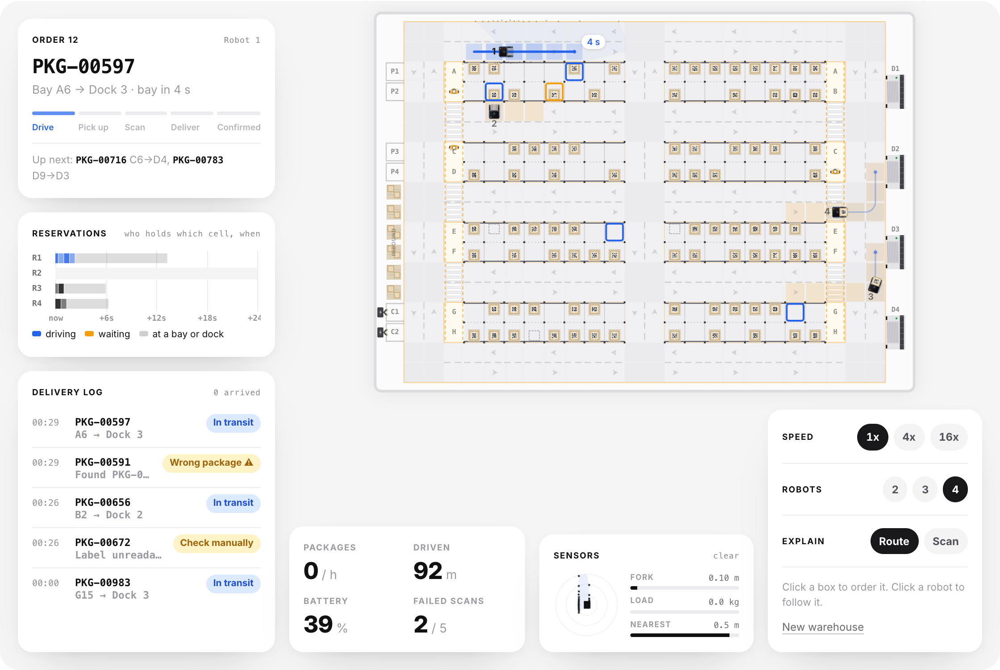
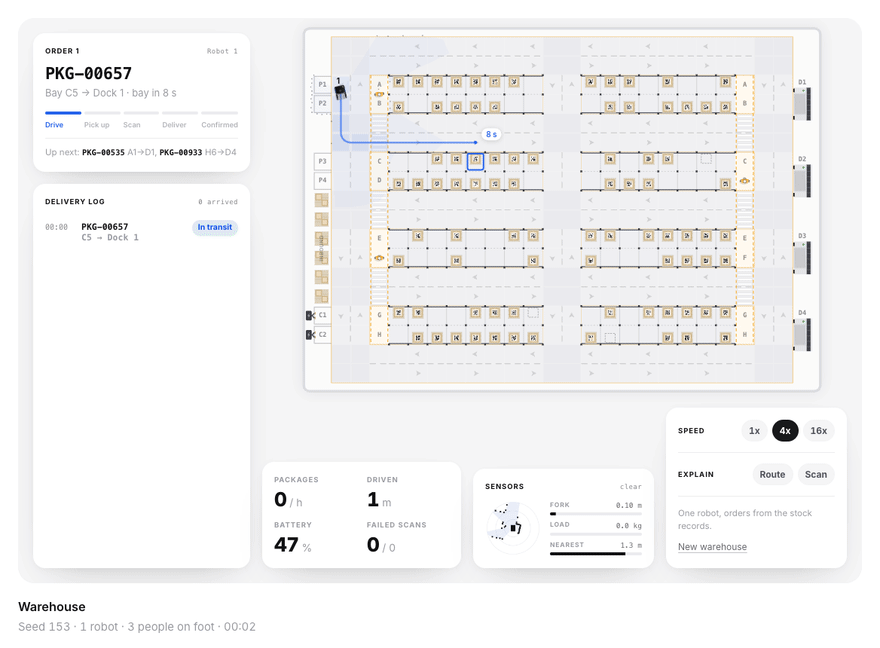
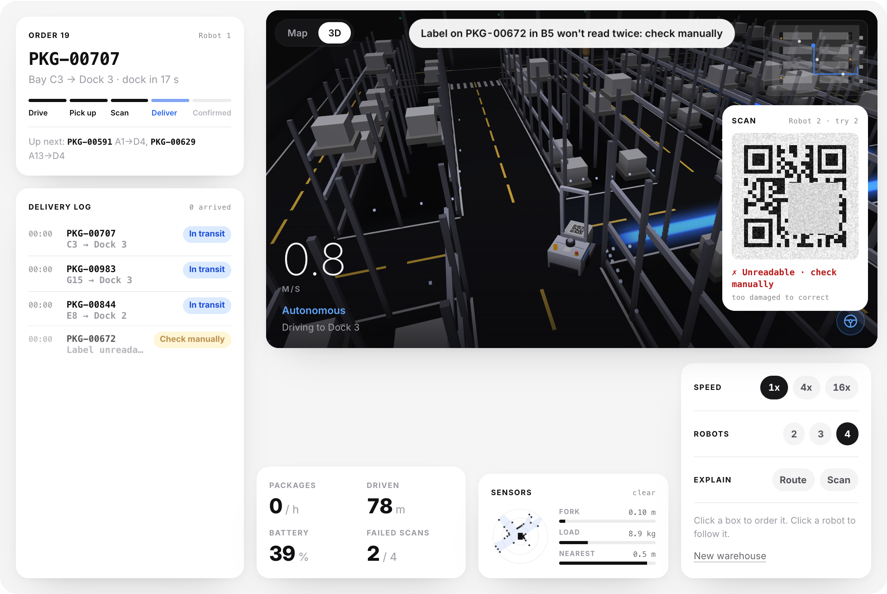
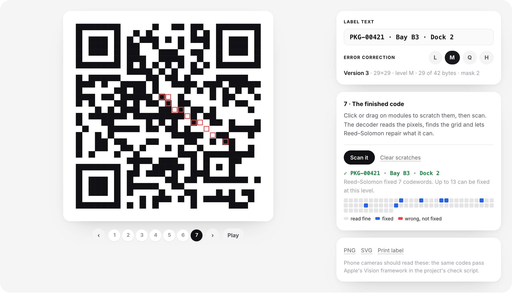

# forklift

A fleet of forklift robots works a small warehouse in the browser: they plan the quickest routes around each other, lift packages out of their bays, decode each QR label from pixels and drop it at the right dock, while a delivery log checks every step. Plain JavaScript.

<p align="center">
  <a href="https://stxqq.github.io/forklift/"></a>
</p>

<p align="center">
  <a href="https://github.com/Stxqq/forklift/actions/workflows/ci.yml"></a>
  <a href="https://stxqq.github.io/forklift/"></a>
  <a href="LICENSE"></a>
  
  
</p>

<p align="center">
  <a href="https://stxqq.github.io/forklift/"><picture><source media="(prefers-color-scheme: dark)" srcset=".github/assets/launch-dark.png"></picture></a>&nbsp;&nbsp;<a href="https://github.com/Stxqq/forklift"><picture><source media="(prefers-color-scheme: dark)" srcset=".github/assets/star-dark.png"></picture></a>
  <br>
  <sub>If you found it useful, a star helps more people find it.</sub>
</p>

The page is a warehouse seen from above: eight rows of rack bays, roads
with a lane each way, four dock doors on the east wall, two chargers and
three people walking about. Every box carries a QR label that says what it
is, where it belongs and which dock it goes to, like `PKG-00657 C5 D1`.

The scanner doesn't peek at the simulation to find out what's on the fork.
It gets a grayscale image of the label, with sensor noise, the odd
reflection from the roof lights and whatever smudges or tears the label
has, and decodes it the way a phone would: find the code, read the format,
unmask, de-interleave, correct with Reed–Solomon, parse. If that fails
twice, the bay gets flagged for a person. The encoder and the decoder are
written from the standard, about 700 lines with no library.

About one box in ten is in the wrong bay or not there at all, and one in
five has a smudged or torn label. The delivery log never takes the robot's
word for anything: each line is worked out from what the fork found, what
the scanner decoded and what was set down at which dock, against what the
order asked for.

- **Watch**: one robot works through orders from the stock records.
- **Dispatch**: click a box to order it. Two to four robots plan around
  each other's bookings and the order goes to whichever gets there first.
- **Drive**: ↑ ↓ to drive, ← → to turn, Space to work the fork, S to scan.
- **Label lab**: type a label and watch the code being built step by step,
  scratch it, scan it, download it.

Every mode can be watched on the floor plan or in 3D, from behind the robot
in focus.

## How it works

<p align="center">
  
</p>

Everything moves in fixed steps of 1/60 s. The diagram is one real order
from seed 153, and the picture in it is the exact image the decoder read.

- **Warehouse.** 28 by 20 one-meter cells. Five east–west roads and three
  north–south ones, each with a lane per direction and right-hand traffic,
  so every road runs both ways but no two robots ever meet head on. People
  walk on two strips beside the racks and cross the roads at zebra
  crossings. The layout is fixed; the stock, the labels and their damage
  come from the seed.
- **Dispatch.** An order names a package, the bay the records say it's in,
  and the dock on its label. Of all free robots and waiting orders, the pair
  that gets a robot to a bay soonest goes first; an order that has waited a
  while gets a head start so none is left behind.
- **Planner.** Space-time A* (safe-interval path planning) over cells,
  headings and time, costed in seconds: a cell at 1.5 m/s, a corner as a
  slower arc, a turn on the spot, the time to get going after a stop.
  Every other robot's plan sits in a reservation table, shifted by however
  late that robot is running, so a robot can wait a moment for a cell to
  free up or drive round, whichever is sooner. Tests check it against
  Dijkstra on an empty floor and that it never plans into a booking.
- **Traffic rules.** The plan is advice; the cells are the law. A robot only
  drives into cells it holds and asks for two ahead. A crossing is granted
  only together with the cell after it, so nobody stops inside one, and a
  plan never waits there either. A cell is handed back once the robot's
  center is a full cell past it, so two robots are never closer than one
  meter, corners included. The shortest loop a robot can queue round is 26
  cells and four robots can hold at most 20, except round the two-cell
  north–south stretches between crossings, where at most three robots are
  let in at once, so they can't lock each other in a circle. Stuck behind
  someone for 2.5 s, a robot replans.
- **Robot.** Differential drive, 0.70 by 0.52 m, 1.5 m/s. It speeds up with
  limited jerk, brakes in time for the end of what it holds, takes corners
  as quarter circles at 0.8 m/s, and turns on the spot only to start a
  route or to face a bay or dock. The fork lifts 1.6 m and reaches 0.62 m,
  both eased, and goes up to the shelf while the robot is still driving in.
- **Collisions.** The robot's real outline, chassis plus fork plus load, is
  two oriented boxes tested against walls, racks, rack uprights, docks,
  other robots and people with the separating axis theorem. The fork may
  enter a bay only lined up with its open face. In Drive every move is
  swept in 3 cm steps and slides along whatever is in the way.
- **Safety field.** The robot watches the next 3.2 m of its route, bends
  included. Someone less than 0.95 m from that line slows it down; less
  than 0.62 m off it and within 1.35 m stops it. A person waits at a
  crossing while a robot is within 1.7 m or holds the cells, then claims
  both lanes at once.
- **Scanner.** It rides on the carriage, so it reads the box right on the
  fork. The label is rasterized at four pixels per module with noise,
  glare and the box's damage painted on. The decoder thresholds, takes
  the outline of the dark pixels, tries versions 1 to 4 and keeps the one
  whose finder and timing patterns match best, reads both copies of the
  format bits (nearest valid word, up to three bits off), unmasks, reads
  the codewords, splits the blocks and runs Berlekamp–Massey, Chien search
  and Forney. Labels are version 2 at level M: 44 codewords, 16 of them
  parity, so up to 8 wrong ones are fixed.
- **Delivery log.** Four kinds of sensor event: the fork found the bay
  empty, a label was decoded, a read failed, something was set down at a
  dock. From those alone an order is *Arrived ✓*, *In transit*, *Missing ✗*,
  *Wrong package ⚠* or *Check manually*.
- **Battery.** It drains per meter and per lift. Below 20 % the robot
  finishes its order and goes to a free charger.

The page draws between the last two steps, so motion is smooth at any
refresh rate. The speed buttons only run more steps per frame, and the
simulation is deterministic: ten minutes at 16x are the same ten minutes as
at 1x and 4x, bit for bit, and a test checks that for Watch and for four
robots in Dispatch.

<p align="center">
  
</p>

Two explainers sit behind the **Explain** chips under the stage. *Route*
replays the space-time search behind the robot's latest route, cells it
settled in blue and cells others had booked in amber, and shows the
reservation table as a timeline. *Scan* opens the decoder up for every read:
camera crop, threshold, the finder patterns it found, the sampled grid and
the bytes.

<p align="center">
  
</p>

## Two views

<p align="center">
  
</p>

The **Map** is the floor plan above: every robot, its route and arrival
time, the boxes on the shelves, the people. The **3D** view is what the
robot in focus sees, in the style of a car's self-driving display: a dark
floor with the lane lines drawn in light grey and yellow, racks, pallets
and boxes at their real heights, people as soft capsules with a hint of
their vests, and the route as a glowing blue ribbon that dims and pulses
while the robot waits for a cell. The safety field is a fan on the floor
that turns amber or red when someone is in it, the lidar returns are faint
dots, and the box it's going for has a blue outline. The corners show the
speed, a status line ("Driving to Bay C6", "Waiting · Robot 2 has the cells
ahead", "Lifting", "Scanning"), a mode icon and a mini map. The choice is
remembered in your browser.

<p align="center">
  
</p>

It's a small WebGL2 renderer written for this, no library: instanced boxes,
cylinders and capsules lit by a sun and a sky light, soft contact shadows
under everything, darkening near the floor as a cheap stand-in for ambient
occlusion, fog to black, and the ribbon drawn once additively and once more
into a half-size buffer that is blurred and added on top, masked by
whatever stands in front of it. The canvas's multisampling smooths the
edges. The chase camera eases toward a point behind and above the robot at
a rate that doesn't depend on the frame rate, follows it round corners, and
holds its bearing while the robot turns on the spot to a bay, so it never
swings into the racks. Both views draw the same interpolated sim state, and
a test checks that the 3D scene can't change what the robots do. With
reduced motion the camera keeps one bearing; without WebGL2 the page says
so and stays on the map.

## Label lab

<p align="center">
  
</p>

Under the stage you can make a label of your own. The lab runs the same
encoder the robots' labels come from and stops at every step: the function
patterns, the bit stream with mode, length, data, terminator and padding,
the Reed–Solomon blocks, the zigzag placement (animated), the eight masks
with their penalty scores (click one to force it), the format bits, and the
finished code. On the last step you can scratch modules and scan it; the
decoder reports how many codewords it fixed, or that it's too damaged, with
a map of which codewords came off the pixels wrong. Labels download as PNG
or SVG with the quiet zone and the text underneath, or go straight to the
printer. Apple's Vision framework reads them, so a phone camera should too.

## Quickstart

```sh
git clone https://github.com/Stxqq/forklift.git
cd forklift
npm run serve          # python3 -m http.server 5105
```

Open <http://localhost:5105>. Any static server works; ES modules just
don't load from `file://`. Nothing to install, and `npm test` needs only
Node 22 or newer. Add `?seed=153` to the address to get the warehouse from
the GIF.

## Is the QR code real?

Yes, and it's checked three ways.

- **The standard's numbers.** The Reed–Solomon parity for the `HELLO WORLD`
  1-Q example and four format words from the standard's table come out
  exactly (`test/qr.test.mjs`).
- **A decoder that isn't mine.** `node scripts/check-vision.mjs` writes
  labels at every version and level as PNGs, plus twelve of the noisy,
  sometimes scuffed 124-pixel images the robot's scanner decodes, and has
  Apple's Vision framework read them. On macOS it reads all 36 back:

  ```console
  $ node scripts/check-vision.mjs
  ok    v1-L mask 2  "PKG-00421 B3 D2"
  ok    v2-M mask 1  "PKG-00421 B3 D2"
  ok    v3-H mask 0  "PKG-00421 B3 D2"
  ok    v4-Q mask 6  "https://stxqq.github.io/forklift/"
  ...
  ok    v2-M scanner, scuffed mask 6  "PKG-00511 A16 D1"
  36/36 read back by Apple Vision
  ```

- **Round trips and damage.** Every version and level at three pixel
  sizes, all eight masks, up to 8 wrong codewords in a version 2-M label
  (fixed, and counted), and twelve wrong ones (refused rather than misread).
  The lab's PNG and SVG downloads are read back by the decoder in the tests.

## Results

`npm run bench` runs eight seeds for half an hour of warehouse time each,
one robot in Watch and four in Dispatch with a queue that never runs dry,
once with cooperative routing and once with simple routing: the quickest
way across an empty floor, orders to whoever is free, first come first
served. The page shows the same numbers from `scripts/results.json`.

| | one robot | four robots |
|---|---|---|
| Packages per hour, cooperative routing | 58 | 233 |
| Packages per hour, simple routing | 57 | 226 |
| Mean trip (order taken to box at the dock), cooperative | 51.0 s | 50.7 s |
| Mean trip, simple | 52.4 s | 54.5 s |
| Reported missing / wrong package / check by hand | 9 / 8 / 14 | 25 / 19 / 47 |
| Closest two robots came | – | 1.00 m |

Before this version the warehouse had one-way lanes round a ring and
robots planned by distance on an empty floor. Same bench: one robot moved
46 packages an hour with a mean trip of 65.5 s, four robots 178 an hour at
61.6 s. Now it's 58 and 233, trips of 51 s: 27 % and 31 % more. Be careful
where the credit goes. Most of it is the layout (roads that run both ways,
so no detours round the ring) and the robot doing things at once (fork up
while driving in, reading the label where it stands). Cooperative routing
and dispatch on top add 3 % with four robots and cut the mean trip by 7 %;
with one robot there is nobody to plan around, and the small gain is
dispatch picking the nearest order. The fleet is busy driving, not waiting:
over three 20-minute runs four robots spend about 3 % of their time held
up by each other, counting planned waits.

94 % of labels read on the first try; Reed–Solomon fixed 1,091 codewords
in 1,351 scans.

<p align="center">
  
</p>

## Limitations

- **The scanner sees an upright label.** It gets the label square-on, so
  the decoder doesn't handle rotation, perspective or blur, and finds the
  code from the outline of its dark pixels rather than searching a cluttered
  image for finder patterns. A phone's decoder does all of that.
- **Byte mode, versions 1 to 4.** No numeric, alphanumeric or kanji mode, no
  versions above 4 (and so no version information block), no ECI. The lab
  says so when a label is too long.
- **One box at a time.** The fork carries a single box, so there's no
  batching of picks; a robot coming back from a dock simply takes the
  nearest waiting order.
- **Plans are optimistic.** Pick times in the reservation table are
  estimates, and people can stop a robot for as long as they stand in its
  path. When a plan goes stale the cell rules keep everyone safe and a
  stuck robot replans, but it can cost a few seconds. Overtaking a robot
  that has stopped to pick isn't allowed; the one behind waits or reroutes.
- **The grid is coarse.** One-meter lanes, one robot per cell, corners as
  arcs through one cell. People walk the strips and cross at crossings and
  never step into a road anywhere else.
- **Driving by hand skips the rules.** In Drive the robot ignores lanes and
  reservations; walls, racks, people and the safety field still apply, and
  the fork docks itself straight before it reaches into a bay.
- **Physics is kinematic.** No wheel slip, no load swinging, and the battery
  is a counter.
- **The 3D view is for watching.** Boxes are ordered on the map; the 3D
  scene uses blob shadows and height darkening rather than real shadow maps
  or screen-space ambient occlusion, and the glow mask is half resolution,
  so a thin halo can show round a mast.

## Project layout

```
src/sim/       warehouse, planner (space-time A*), robot, collide, world
               (reservations, dispatch, people, jobs), orders and log,
               qr and rs (no DOM)
src/render/    canvas stage, robot drawing, anatomy spec sheet
src/render3d/  WebGL2 renderer, scene building, chase camera, matrices
src/lab/       PNG and SVG label export
src/ui/        the page: sessions, 3D view and HUD, label lab, explainers
scripts/       bench.mjs, results.json, check-vision.mjs, png.mjs
test/          node:test suites
```

## Credits

- QR codes follow ISO/IEC 18004. The worked examples in Thonky's QR code
  tutorial were the test vectors, and the way the function patterns,
  format bits and codeword zigzag are laid out follows Project Nayuki's QR
  Code generator library (MIT).
- Reed–Solomon decoding is Berlekamp–Massey with Chien search and Forney's
  formula, as in Lin and Costello, *Error Control Coding* (2004).
- Path planning is A* from Hart, Nilsson and Raphael, *A Formal Basis for
  the Heuristic Determination of Minimum Cost Paths* (1968), in space and
  time as safe-interval path planning from Phillips and Likhachev, *SIPP:
  Safe Interval Path Planning for Dynamic Environments* (ICRA 2011), over
  a reservation table as in Silver, *Cooperative Pathfinding* (AIIDE 2005).
- The collision test is the separating axis theorem.
- The look follows my portfolio; type is Inter by Rasmus Andersson.

## License

MIT © 2026 Stefan Carapic
